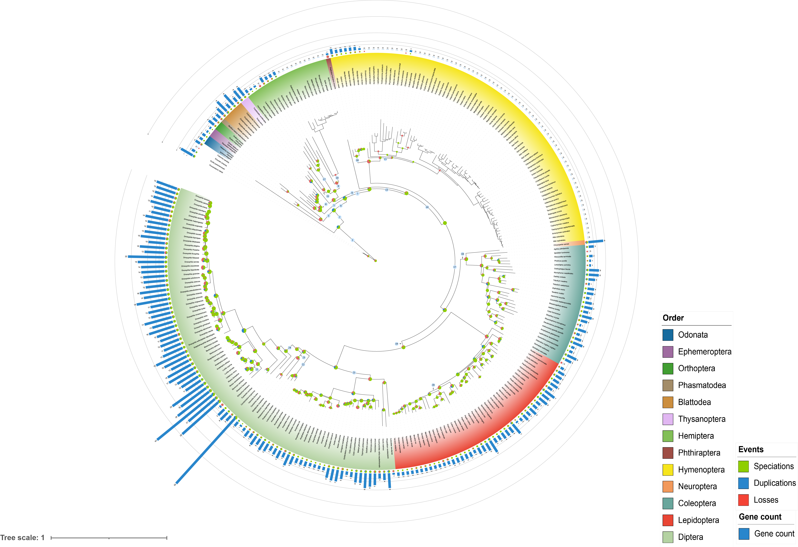
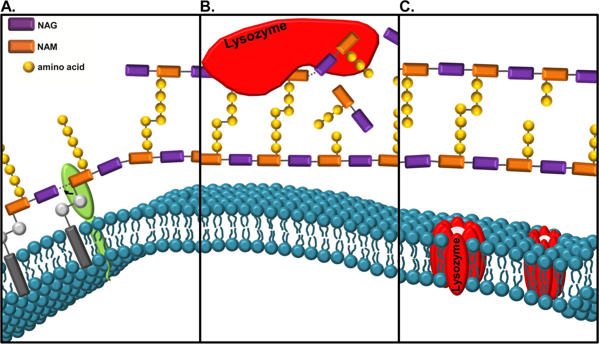

## Autores

Héctor Romão, José Castro e Natália Pereira

Script organizado para atividade prática na disciplina Métodos Filogenéticos Comparativos.

## Introdução

O conjunto de dados tem o contexto de um estudo de genômica comparativa que busca investigar adaptações do número de cópias de genes de lisozimas em insetos.



A lisozima consiste em uma enzima de atividade antibacteriana que atua hidrolizando a ponte entre NAG e NAM, desestruturando o peptideglicano, induzindo assim a morte bacteriana.



Em *Musca domestica*, as lisozimas foram cooptadas para atuação como enzimas digestivas, havendo adaptação neste clado. Desta forma, investigar o número de cópias pode revelar adaptações presentes em outros pontos na filogenia de Insecta.

## Pacotes

```{r}
#| label: setup
library(ape)
library(phytools)
library(adephylo)
library(phylobase)
library(picante)
library(geiger)
library(TreeSim)
library(phylosignal)
library(caper)
library(phylolm)
library(here)
library(ggtree)
```

## Importação dos dados

### Árvore filogenética

```{r}
#| label: import-tree
#| fig-cap: "Árvore filogenética de Insecta em layout circular"
phy <- read.tree(here::here("data/insecta_tree.txt"))

suppressWarnings(
  ggtree(phy, layout = "circular") +
    geom_tiplab(aes(angle = angle), size = 1, color = "gray")
)
print(paste0("A árvore é ultrametrica?: ",is.ultrametric(phy)))
print(paste0("O número de folhas: ",length(phy$tip.label)))

#Extração de um clado menor (Polyneoptera)
clado_Pol <- extract.clade(phy, node = 289)
plot(clado_Pol)
```

### Tabela de traços

```{r}
#| label: import-traits
traits <- read.table(here::here("data/insecta_traits.tsv"), h = T, row.names = 1)
head(traits)
phy <- read.tree(here::here("data/insecta_tree.txt"))
```

------------------------------------------------------------------------

## Preparo dos objetos para as análises

Os traços analisados são extraídos da tabela e convertidos em matrizes. A seguir, verificamos a distribuição do traço C-type com uma transformação logarítmica.

```{r}
#| label: prepare-objects
#| fig-cap: "Distribuição de log(C-type count + 1)"
c_type_count <- as.matrix(traits[, 1])
i_type_count <- as.matrix(traits[, 2])

hist(log(c_type_count) + 1, main = "", xlab = "log(C-type count + 1)")

# Nomeando as linhas com os rótulos da árvore
rownames(c_type_count) <- phy$tip.label
rownames(i_type_count) <- phy$tip.label

# Versões log-transformadas com nomes para uso nos testes
log_c_type_count <- log(c_type_count[, 1] + 1)
names(log_c_type_count) <- rownames(c_type_count)

log_i_type_count <- log(i_type_count[, 1] + 1)
names(log_i_type_count) <- rownames(i_type_count)


##Preparo para os dados de Polyneoptera

log_c_type_count_Pol <- log_c_type_count[clado_Pol$tip.label]
```

------------------------------------------------------------------------

## Sinal Filogenético

### Métodos baseados em modelo (Model-Based Methods)

Estes métodos avaliam a adequação da estrutura de covariância presente na filogenia para explicar a variação dos traços.

#### K de Blomberg

O **K de Blomberg** compara a variação observada nos traços com a esperada sob evolução por **Movimento Browniano (BM)**. Valores de K \> 1 indicam forte sinal filogenético (parentes mais similares do que o esperado), enquanto K \< 1 indica sinal fraco.

```{r}
#| label: blomberg-k-observed
# Valores observados de K
k_obs_c_type <- Kcalc(log_c_type_count, phy)
print(paste0("Valor observado de K para C-type: ", round(k_obs_c_type, 4)))

k_obs_i_type <- Kcalc(log_i_type_count, phy)
print(paste0("Valor observado de K para I-type: ", round(k_obs_i_type, 4)))


###Teste para Polyneoptera
k_obs_c_type_Pol <- Kcalc(log_c_type_count_Pol, clado_Pol)
print(paste0("Valor observado de K para C-type em Polyneoptera", round(k_obs_c_type_Pol, 4)))

```

Para contextualizar o K observado, realizamos **50 simulações** dos traços sob três cenários:

-   **BM** (*Brownian Motion*): evolução neutra esperada
-   **Permutado** (*randomized*): traços misturados aleatoriamente mantendo os valores
-   **Normal** (*null normal*): valores sorteados de uma distribuição normal

```{r}
#| label: blomberg-simulations
#| fig-cap: !expr c("K sob Movimento Browniano", "K sob permutação aleatória", "K sob distribuição normal")
#| layout-ncol: 3
Kbm   <- numeric()
Krand <- numeric()
Knorm <- numeric()

set.seed(42)
for (i in 1:50) {
  T.brownian <- fastBM(phy, a = 10, sig2 = 10, internal = F, nsim = 1)
  Kbm[i] <- Kcalc(T.brownian, phy)

  y.norm <- as.matrix(rnorm(nrow(traits), 0, 1))
  rownames(y.norm) <- phy$tip.label
  Knorm[i] <- Kcalc(y.norm[, 1], phy)

  bs <- as.matrix(traits[, 1])
  bs <- sample(bs, 279, replace = FALSE)
  names(bs) <- phy$tip.label
  Krand[i] <- Kcalc(bs, phy)
}

hist(Kbm,   nclass = 50,  col = "grey", xlab = "K sob BM",           main = "")
hist(Krand, nclass = 100, col = "grey", xlab = "K permutado",         main = "")
hist(Knorm, nclass = 50,  col = "grey", xlab = "K distribuição normal", main = "")

```

```{r}
#| label: blomberg-summary
cat("Estatísticas para K sob BM:\n")
cat("  Média:", round(mean(Kbm), 4), "\n")
cat("  IC 95%:", round(quantile(Kbm, c(0.025, 0.975)), 4), "\n")
cat("  Simulações com K > K observado (C-type):",
    sum(ifelse(Kbm > k_obs_c_type[, 1], 1, 0)), "\n\n")

cat("Quantil 95% de K permutado:", round(quantile(Krand, 0.95), 4), "\n")
cat("Quantil 95% de K normal:   ", round(quantile(Knorm, 0.95), 4), "\n")
```

#### K de Blomberg e Lambda de Pagel via `phytools`

O **Lambda de Pagel** (λ) é outro estimador do sinal filogenético, variando de 0 (sem sinal) a 1 (evolução puramente browniana). O teste de razão de verossimilhança avalia se λ difere significativamente de zero.

```{r}
#| label: phytools-signal
cat("=== K de Blomberg e Lambda de Pagel (C-type) ===\n")
phylosig(phy, log_c_type_count, method = "K", test = T, nsim = 1000)
phylosig(phy,log_c_type_count,method="lambda",test=T) 

cat("\nQuantis de K permutado (referência):\n")
quantile(Krand, c(0.05, 0.9995))

cat("\n=== Lambda de Pagel e K de Blomberg (C-type) para Polyneoptera ===\n")
phylosig(clado_Pol, log_c_type_count_Pol, method = "lambda", test = T)
phylosig(clado_Pol, log_c_type_count_Pol, method = "K", test = T)


```

> **Nota:** As análises para `i_type_count` estão comentadas abaixo e podem ser ativadas conforme necessário.

```{r}
#| label: phytools-itype
#| eval: false
# phylosig(phy, log_i_type_count, method = "K", test = T, nsim = 1000)
# phylosig(phy, log_i_type_count, method = "lambda", test = T)
```

------------------------------------------------------------------------

### Métodos Empíricos Estatísticos

#### I de Moran

O **I de Moran** avalia a autocorrelação filogenética com base em uma matriz de pesos de vizinhança derivada da filogenia. Valores positivos indicam que espécies filogeneticamente próximas têm traços similares.

A árvore é transformada em uma **matriz de covariância** baseada no comprimento dos ramos:

```{r}
#| label: moran-setup
phy.cor <- vcv(phy, model = "Brownian", cor = T)
diag(phy.cor) <- 0

I_c.type <- Moran.I(log_i_type_count, phy.cor)
I_i.type <- Moran.I(log_c_type_count, phy.cor)


##Para Polyneoptera##
phy.pol.cor <- vcv(clado_Pol, model = "Brownian", cor = T)
diag(phy.pol.cor) <- 0
I_pol <- Moran.I(log_c_type_count_Pol, phy.pol.cor)


cat("\n=== Valores observados de I de Moran ===\n")
print(paste0("Valor observado de I para C-type: ", I_c.type$observed))
print(paste0("Valor observado de I para C-type em Polyneoptera: ", I_pol$observed))


```

A seguir, realizamos **1000 simulações** do I de Moran sob três cenários: BM, distribuição normal (nula) e permutação dos dados originais.

```{r}
#| label: moran-simulations
#| fig-cap: !expr c("I de Moran sob BM", "I de Moran (nulo normal)", "I de Moran (permutado)")
#| layout-ncol: 3
sim.trait <- fastBM(phy, a = 10, sig2 = 10, internal = F, nsim = 100)

I.sim   <- numeric(); I.simP  <- numeric()
I.sim2  <- numeric(); I.sim2P <- numeric()
I.sim3  <- numeric()

for (i in 1:ncol(sim.trait)) {
  I.sim[i]   <- Moran.I(sim.trait[, i], phy.cor)$observed
  I.simP[i]  <- Moran.I(sim.trait[, i], phy.cor)$p.value
  I.sim2[i]  <- Moran.I(rnorm(nrow(traits), 0, 1), phy.cor)$observed
  I.sim2P[i] <- Moran.I(rnorm(nrow(traits), 0, 1), phy.cor)$p.value
  rnd <- sample(log_c_type_count, replace = F)
  I.sim3[i]  <- Moran.I(rnd, phy.cor)$observed
}

hist(I.sim,  nclass = 100, col = "grey", xlab = "I de Moran sob BM",        ylab = "Simulações", main = "")
hist(I.sim2, nclass = 100, col = "grey", xlab = "I de Moran (nulo normal)",  ylab = "Simulações", main = "")
hist(I.sim3, nclass = 100, col = "grey", xlab = "I de Moran (permutado)",    ylab = "Simulações", main = "")
```

```{r}
#| label: moran-summary
cat("Significativas sob BM (p < 0.05):", length(which(I.simP < 0.05)), "\n")
cat("Significativas sob normal (p < 0.01):", length(which(I.sim2P < 0.01)), "\n\n")

cat("Quantis (I nulo normal):", round(quantile(I.sim2, c(0.025, 0.975)), 4), "\n")
cat("Quantis (I permutado):  ", round(quantile(I.sim3, c(0.025, 0.975)), 4), "\n")
```

#### Simulação com alto sinal filogenético (BM lento, sig2 = 0.1)

```{r}
#| label: moran-slow-bm
#| fig-cap: "I de Moran sob BM com evolução lenta (alto sinal filogenético)"
sim.trait.w <- fastBM(phy, a = 5, sig2 = 0.1, internal = F, nsim = 100)
I.sim.w <- numeric()
W <- 1 / cophenetic(phy)
diag(W) <- 0

for (i in 1:ncol(sim.trait.w)) {
  I.sim.w[i] <- Moran.I(sim.trait.w[, i], W)$observed
}

hist(I.sim.w, nclass = 100, col = "grey",
     xlab = "I de Moran sob BM (evolução lenta)", ylab = "Simulações", main = "")
cat("Média de I sob evolução lenta:", round(mean(I.sim.w), 4), "\n")
```

#### Correlograma filogenético

O correlograma avalia como o I de Moran varia em diferentes **janelas de distância filogenética**, permitindo identificar em que escala temporal o sinal filogenético é mais forte.

```{r}
#| label: moran-correlogram
#| fig-cap: "Correlograma filogenético do I de Moran para C-type"
dist <- as.matrix(cophenetic(phy))
klim <- c(0, 50, 100, 200, 400, 600, 800, 1030)

Im <- numeric()
Ip <- numeric()

for (i in 1:(length(klim) - 1)) {
  W <- ifelse(dist > klim[i] & dist < klim[i + 1], 1, 0)
  diag(W) <- 0
  I <- Moran.I(log_c_type_count, W)
  Im[i] <- I$observed
  Ip[i] <- I$p.value
}

plot(klim[2:8], Im, type = 'b',
     xlab = "Distância filogenética", ylab = "I de Moran",
     main = "Correlograma filogenético")
```

#### Simulações do I de Moran sob modelo OU

O modelo **Ornstein-Uhlenbeck (OU)** simula evolução com atração a um ótimo. O parâmetro **alpha** controla a força dessa atração: quanto maior, menor o sinal filogenético esperado.

```{r}
#| label: moran-ou
#| fig-cap: "Relação entre o parâmetro alpha (OU) e o I de Moran"
phy.cor <- vcv(phy, cor = T)
diag(phy.cor) <- 0

alpha.ou <- numeric()
I.simou  <- numeric()

phy.sim <- rcoal(279)
phy.cor.sim <- vcv(phy.sim, cor = T)
diag(phy.cor.sim) <- 0

set.seed(42)
for (i in 1:100) {
  alpha.ou[i] <- runif(1, 0.01, 25)
  phy2 <- rescale(phy.sim, model = "depth", 1)
  sim.trait.ou <- fastBM(phy2, a = 10, alpha = alpha.ou[i], theta = 5, internal = F, nsim = 1)
  I.simou[i] <- Moran.I(sim.trait.ou, phy.cor.sim)$observed
}

plot(alpha.ou, I.simou, cex = 1, pch = 16,
     xlab = "Alpha (OU)", ylab = "I de Moran",
     main = "Sinal filogenético esperado sob OU")
```

------------------------------------------------------------------------

## PVR & PSR

A abordagem **PVR** (*Phylogenetic Eigenvector Regression*) decompõe a estrutura filogenética em autovetores obtidos via PCoA das distâncias entre espécies, que são então usados como preditores em regressão.

A **curva PSR** (*Phylogenetic Signal Representation*) plota o R² acumulado dos autovetores contra a proporção de variação filogenética explicada --- um desvio acima da diagonal indica maior sinal filogenético do que o esperado sob BM.

```{r}
#| label: pvr-setup
dist <- as.matrix(cophenetic(phy))
dist <- sqrt(dist)  # para PSR: lineariza distâncias (compatível com BM)
pcoa <- pcoa(dist)
vec  <- pcoa$vectors
val  <- pcoa$values
eigcum <- val[1:279, 4]  # proporção acumulada dos autovetores
```

### Visualização com `phylo4d`

```{r}
#| label: pvr-plot
#| fig-cap: "PVR com os 3 primeiros eixos (todos os Insecta)"
phy_pvr1 <- phylo4d(phy, vec[, 1:3])
table.phylo4d(phy_pvr1, show.tip.label = FALSE, center = FALSE,
              ratio.tree = 0.7, box = FALSE, cex.symbol = 0.4, cex.label = 1)
```

```{r}
#| label: pvr-Diptera
#| fig-cap: "PVR restrito a Polyneoptera (node 467)"
clado_Dip <- extract.clade(phy, node = 467)
phy_pvr2  <- phylo4d(clado_Dip, vec[, 1:3])
table.phylo4d(phy_pvr2, show.node.label = F, show.tip.label = FALSE,
              center = FALSE, ratio.tree = 0.7, box = FALSE,
              cex.symbol = 0.4, cex.label = 1)
```

### Seleção de autovetores

Três métodos são utilizados para selecionar os autovetores mais informativos:

**Método 1 --- Variância acumulada \> 55%**

```{r}
#| label: pvr-method1
vec30 <- min(which(eigcum > 0.55))
summary(lm(log_c_type_count ~ vec[, 1:vec30]))
summary(lm(log_c_type_count ~ vec[, 1:3]))

S.PVR <- lm(log_c_type_count ~ vec[, 1:vec30])$residuals
Moran.I(S.PVR, phy.cor)  # resíduos ainda têm sinal filogenético?
```

**Método 2 --- Stepwise por AIC**

```{r}
#| label: pvr-method2
summary(step(lm(log_c_type_count ~ vec[, 1:min(which(eigcum > 0.55)) - 1]),
             direction = "forward"))
```

**Método 3 --- Correlação significativa com Y (p \< 0.05)**

```{r}
#| label: pvr-method3
pv <- numeric()
for (i in 1:ncol(vec)) {
  pv[i] <- summary(lm(log_c_type_count ~ vec[, i]))$coefficients[2, 4]
}
selpvr  <- which(pv < 0.05)
vec_sel <- vec[, selpvr]
summary(lm(log_c_type_count ~ vec_sel))

S.PVR1 <- lm(log_c_type_count ~ vec_sel)$residuals
Moran.I(S.PVR1, phy.cor)
```

### Seleção minimizando o I de Moran residual

Função de seleção *forward* que adiciona autovetores sequencialmente, escolhendo em cada passo aquele que minimiza o I de Moran nos resíduos.

```{r}
#| label: pvr-forward-moran-fn
forward_moran_selection <- function(y, X, W, threshold,
                                    use_abs = TRUE,
                                    verbose = TRUE,
                                    na_action = na.omit) {
  if (!is.data.frame(X)) X <- as.data.frame(X)

  dat <- na_action(data.frame(y = y, X))
  y   <- dat$y
  X   <- dat[, setdiff(names(dat), "y"), drop = FALSE]

  selected  <- character(0)
  remaining <- names(X)
  history   <- list()
  step      <- 0

  repeat {
    if (length(remaining) == 0) { if (verbose) message("Nenhum preditor restante."); break }

    results_step <- data.frame(predictor = remaining, moran_I = NA_real_,
                                criterion = NA_real_, stringsAsFactors = FALSE)
    models_step  <- vector("list", length(remaining))

    for (i in seq_along(remaining)) {
      vars <- c(selected, remaining[i])
      fit  <- lm(as.formula(paste("y ~", paste(vars, collapse = " + "))),
                 data = data.frame(y = y, X))
      I_obs <- Moran.I(resid(fit), W)$observed
      results_step$moran_I[i]  <- I_obs
      results_step$criterion[i] <- if (use_abs) abs(I_obs) else I_obs
      models_step[[i]] <- fit
    }

    best_idx  <- which.min(results_step$criterion)
    best_pred <- results_step$predictor[best_idx]
    best_I    <- results_step$moran_I[best_idx]
    best_crit <- results_step$criterion[best_idx]

    step     <- step + 1
    selected <- c(selected, best_pred)
    remaining <- setdiff(remaining, best_pred)

    history[[step]] <- list(step = step, tested = results_step, chosen = best_pred,
                            moran_I = best_I, criterion = best_crit,
                            model = models_step[[best_idx]], selected_so_far = selected)

    if (verbose)
      message(sprintf("Passo %d | Escolhido: %s | Moran.I = %.6f | Critério = %.6f",
                      step, best_pred, best_I, best_crit))

    if (best_crit <= threshold) { if (verbose) message("Threshold atingido."); break }
  }

  final_model <- if (length(history) > 0) history[[length(history)]]$model else NULL
  list(selected = selected, X_selected = X[, selected, drop = FALSE], data_used = dat)
}
```

```{r}
#| label: pvr-forward-moran-run
phy.cor1 <- ifelse(phy.cor > 0.75, 1, 0)
diag(phy.cor1) <- 1

out <- forward_moran_selection(
  y = log_c_type_count,
  X = as.data.frame(vec),
  W = phy.cor1,
  threshold = 0.15,
  use_abs = TRUE
)

vec.opt <- as.matrix(out$X_selected)
summary(lm(log_c_type_count ~ vec.opt))
```

### R² sob BM --- distribuição esperada

```{r}
#| label: pvr-r2-bm
#| fig-cap: "Distribuição de R² (PVR - 8 eixos) sob BM"
sim.trait <- fastBM(phy, a = 10, sig2 = 10, internal = F, nsim = 1000)

r2.pvr <- numeric()
for (i in 1:ncol(sim.trait)) {
  r2.pvr[i] <- summary(lm(sim.trait[, i] ~ vec[, 1:8]))$r.squared
}

hist(r2.pvr, nclass = 50, col = "grey", main = "",
     xlab = "R² (PVR - 8 eixos)", ylab = "Simulações")
abline(v = 0.7, col = "red", lwd = 2)
cat("Mediana do R²:", round(median(r2.pvr), 4), "\n")
```

------------------------------------------------------------------------

## Curva PSR

### Todos os Insecta

```{r}
#| label: psr-all
#| fig-cap: "Curva PSR para todos os Insecta"
r2psr <- numeric()
for (i in 1:(nrow(dist) - 1)) {
  r2psr[i] <- summary(lm(log_c_type_count ~ vec[, 1:i]))$r.squared
}

eig    <- append(0, eigcum[-279])
r2psr0 <- append(0, r2psr)

plot(eig, r2psr0, pch = 16, cex = 1.25, type = "b",
     xlim = c(0, 1), ylim = c(0, 1),
     xlab = "Proporção acumulada dos autovetores",
     ylab = "R²")
abline(a = 0, b = 1, lty = 2, lwd = 2)
```

### Diptera --- manipulação do ramo de *Hermetia*

Para investigar o efeito de ramos longos no sinal filogenético, manipulamos os comprimentos de ramos específicos dentro de Diptera.

```{r}
#| label: psr-diptera-setup
#| fig-cap: !expr c("Cladograma original de Diptera", "Cladograma de Diptera com ramos manipulados")
#| layout-ncol: 2
clado_Dip <- extract.clade(phy, node = 467)
plot(clado_Dip, main = "Original")

phy.Dip <- clado_Dip
phy.Dip$edge.length[38] <- phy.Dip$edge.length[38] * 6
phy.Dip$edge.length[1]  <- phy.Dip$edge.length[1]  * 15
plot(phy.Dip, main = "Ramos manipulados")
```

```{r}
#| label: psr-diptera-curve
#| fig-cap: "Curva PSR para Diptera (ramos manipulados)"
dist   <- as.matrix(cophenetic(phy.Dip))
dist   <- sqrt(dist)
pcoa   <- pcoa(dist)
vec    <- pcoa$vectors
val    <- pcoa$values
eigcum <- val[1:92, 4]

log_c_type_count <- log_c_type_count[phy.Dip$tip.label]

r2psr <- numeric()
for (i in 1:(nrow(dist) - 1)) {
  r2psr[i] <- summary(lm(log_c_type_count ~ vec[, 1:i]))$r.squared
}

eig    <- append(0, eigcum[-92])
r2psr0 <- append(0, r2psr)

plot(eig, r2psr0, pch = 16, cex = 1.25, type = "b",
     xlim = c(0, 1), ylim = c(0, 1),
     xlab = "Proporção acumulada dos autovetores", ylab = "R²")
abline(a = 0, b = 1, lty = 2, lwd = 2)
```

### Análise para Polyneoptera (Alto sinal filogenético)

```{r}
dist_pol   <- as.matrix(cophenetic(clado_Pol))
dist_pol   <- sqrt(dist)
pcoa_pol   <- pcoa(dist)
vec_pol    <- pcoa$vectors
val_pol    <- pcoa$values
eigcum_pol <- val[1:8, 4]


r2psr_pol <- numeric()
for (i in 1:(nrow(dist) - 1)) {
  r2psr_pol[i] <- summary(lm(log_c_type_count_Pol ~ vec_pol[, 1:i]))$r.squared
}

eig_pol    <- append(0, eigcum_pol[-8])
r2psr0_pol <- append(0, r2psr_pol)

plot(eig_pol, r2psr0_pol, pch = 16, cex = 1.25, type = "b",
     xlim = c(0, 1), ylim = c(0, 1),
     xlab = "Proporção acumulada dos autovetores", ylab = "R²")
abline(a = 0, b = 1, lty = 2, lwd = 2)
```

### PSR com envelope Browniano

Para comparar a curva PSR observada com a expectativa sob BM, geramos um envelope de simulação.

```{r}
#| label: psr-brownian-envelope
#| fig-cap: "Curva PSR com envelope Browniano (azul = média, vermelho = min/max)"
sim.trait <- fastBM(phy.Dip, a = 10, sig2 = 10, internal = F, nsim = 10)
brown_r2  <- matrix(0, ncol(sim.trait), length(r2psr))
r2bw      <- numeric()

for (i in 1:ncol(sim.trait)) {
  brown <- sim.trait[, i]
  for (j in 1:(nrow(dist) - 1)) {
    r2bw[j]   <- summary(lm(brown ~ vec[, 1:j]))$r.squared
    r2psr[j]  <- summary(lm(log_c_type_count ~ vec[, 1:j]))$r.squared
  }
  brown_r2[i, ] <- r2bw
}

meanBW <- append(0, apply(brown_r2, 2, mean))
maxBW  <- append(0, apply(brown_r2, 2, max))
minBW  <- append(0, apply(brown_r2, 2, min))

plot(eig, r2psr0, pch = 16, cex = 1.25, type = "b",
     xlim = c(0, 1), ylim = c(0, 1),
     xlab = "Proporção acumulada dos autovetores", ylab = "R²")
lines(eig, meanBW, type = "b", col = "blue",  pch = 16, cex = 1.25)
lines(eig, maxBW,  type = "l", col = "red",   lwd = 1.5)
lines(eig, minBW,  type = "l", col = "red",   lwd = 1.5)
abline(a = 0, b = 1, lty = 2)
legend("topleft",
       legend = c("Observado", "Média BM", "Min/Max BM"),
       col = c("black", "blue", "red"),
       lty = c(1, 1, 1), pch = c(16, 16, NA), bty = "n")
```
